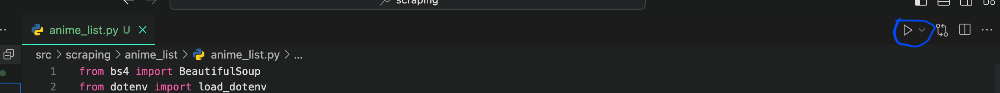

# WEB SCRAPING ANIMEKU

This project is under development for now and the scraping process takes data from the ANIMEKU website. The scraping results will be used as an Anime Streaming Web API in the future.

## Run Locally
Install python global dependencies
```bash
pip install requests
pip install beautifulsoup4
pip install selenium
pip install lxml
```

Clone the project
```bash
git clone https://github.com/KhenCahyo13/Web-Scrapping-ANIMEKU.git
```

Go to the project directory
```bash
cd project-name
```

For now we don't have a main file to run all the scripts in this project. However, you can run this project from any existing file by clicking the play button on your VSCode. Here is a picture of the instructions:



## Features

- Scraping anime list
- Scraping popular anime
- JSON data scraping output

## Upcoming Features

- Scraping anime details
- Scraping with video source to streaming

## Contributing

Contributions are always welcome! You can contribute on this project every time.